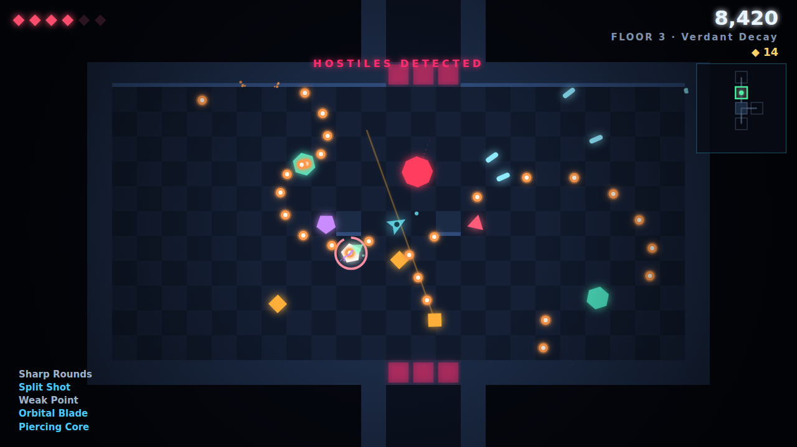
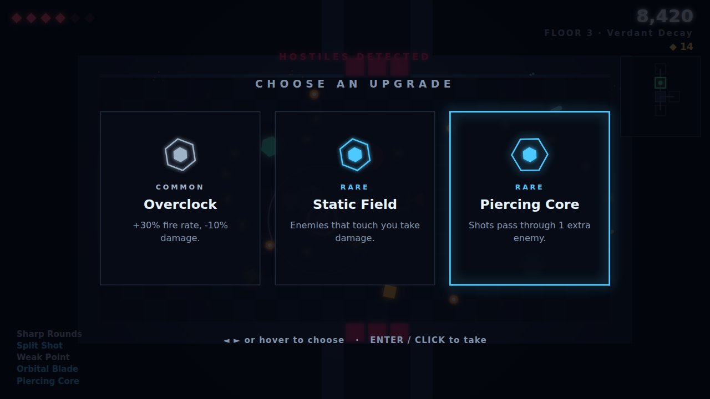
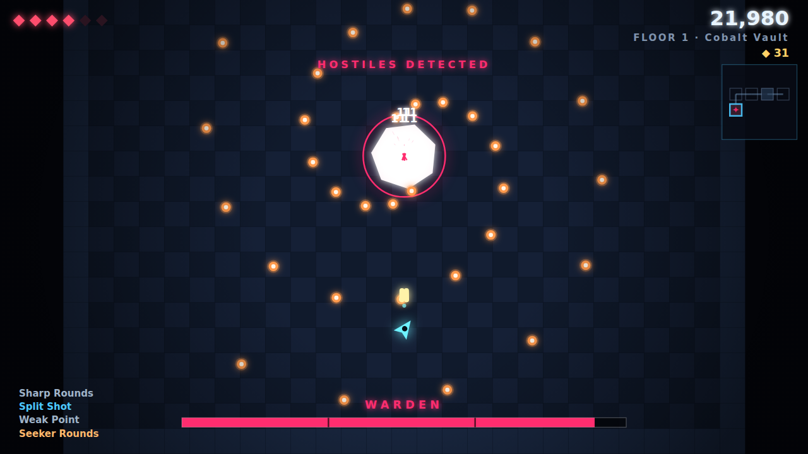

# Neon Depths

A 2D action roguelike that runs in the browser. Procedurally generated dungeons,
twin-stick combat, and a run-scoped upgrade system — built from scratch in
TypeScript on a custom engine, with **no game framework and no art or audio
assets**. Every shape is drawn at runtime; every sound is synthesised on the
fly. The whole game is a ~90 KB JavaScript bundle.

**▶ [Play it in your browser](https://woohaharam.github.io/game/)** — no install,
works on desktop and mobile.



---

## What this project demonstrates

This was built as a portfolio piece, so the interesting part is not that it is a
game — it is *how* it is put together. Each of these was a deliberate decision
with a trade-off behind it, documented at the point in the code where it matters:

| Area | What's in here |
| --- | --- |
| **Game loop** | Fixed-timestep simulation with rendering interpolation and a spiral-of-death guard, so physics and hit detection behave identically at 30, 60 and 144 Hz |
| **Procedural generation** | Two-stage dungeon builder — an abstract room graph grown as a branching tree, then carved into tiles — with a flood-fill validation pass that guarantees no seed can ever produce unreachable geometry |
| **Determinism** | One 32-bit seed reproduces an entire run exactly. Gameplay and cosmetic randomness run on separate streams so a particle effect can never shift a loot roll |
| **Performance** | Object pooling for every short-lived entity, a uniform-grid spatial hash as the collision broadphase, and viewport culling on a 200,000-tile map. Steady 60 fps at ~1.1 ms/frame with hundreds of live projectiles |
| **AI** | A shared finite state machine driving six enemy archetypes, all built around one rule: telegraph, then commit to a locked-in attack |
| **Architecture** | The simulation never touches the DOM. `World.update(step, intent)` is the entire interface, which is why the integration tests run thousands of ticks headlessly in CI |
| **Game feel** | Hit-stop, trauma-based screen shake, input buffering, coyote-style dash invulnerability, slow motion on damage — the layer that separates "functional" from "good to hold" |
| **Testing** | 880+ tests, including seed sweeps that assert generator invariants across hundreds of layouts |
| **Accessibility of reach** | Keyboard + mouse, and a floating twin-stick touch layout so the link works on a phone |

## Controls

| Action | Keyboard / Mouse | Touch |
| --- | --- | --- |
| Move | `WASD` / Arrows | Left thumbstick (floats where you touch) |
| Aim | Mouse | Right thumbstick |
| Fire | Click / `J` | Right thumbstick (auto-fires) |
| Dash | `Space` / `Shift` | `DASH` button |
| Pause & options | `Esc` / `P` | — |
| Retry | `R` | — |

Dashing grants brief invulnerability — dodging *through* an attack is the core
defensive skill, not running from it.

## How a run works

Each floor is a graph of rooms. Walking into a combat room seals the doors until
everything in it is dead. Dead ends hold the rewards: a free upgrade in a
treasure room, three purchasable ones in a shop, and the Warden at the far end
of the floor. Killing it opens a portal down, and the next floor is bigger,
faster, and drawn in a different palette.

Score is driven by a combo multiplier that decays a few seconds after each kill,
so playing aggressively pays more than clearing a room from the safest corner.

Type a seed on the title screen to replay a specific run — numbers or words both
work.

<table>
<tr>
<td width="50%"></td>
<td width="50%"></td>
</tr>
<tr>
<td align="center"><em>Pick one of three, over the frozen fight</em></td>
<td align="center"><em>Three-phase boss with escalating patterns</em></td>
</tr>
</table>

## Running it locally

Requires Node 20 or newer.

```bash
npm install
npm run dev        # dev server with hot reload
```

```bash
npm test           # unit + headless integration tests
npm run typecheck  # strict TypeScript, no emit
npm run build      # typecheck, then production bundle into dist/
```

## Project layout

```
src/
  engine/          Game-agnostic runtime — reusable in another project
    loop.ts          Fixed-timestep loop with interpolation
    rng.ts           Seeded, deterministic PRNG (mulberry32)
    pool.ts          Fixed-capacity object pool
    spatial-hash.ts  Uniform-grid collision broadphase
    fsm.ts           Finite state machine
    input.ts         Intent-based input (keyboard, mouse, touch)
    renderer.ts      Canvas 2D with a virtual resolution and letterboxing
    camera.ts        Follow camera with trauma-based shake
    particles.ts     Pooled particle system
    audio.ts         Procedural Web Audio synthesis — no sound files
    scene.ts         Scene stack with transparent overlays
    save.ts          Versioned localStorage persistence
  game/            Everything specific to Neon Depths
    config.ts        Every balance number, in one reviewable file
    world.ts         The simulation
    collision.ts     Circle-vs-tilemap resolution and line of sight
    spawn-director.ts Budget-based room population
    dungeon/         Two-stage procedural generator
    entities/        Player, enemies, pooled projectile structs
    combat/          Damage resolution
    progression/     Stats, modifiers, upgrade pool
    render/          World rendering and palettes
    ui/              HUD, minimap, touch controls
    scenes/          Menu, game, reward, pause, game over
tests/             Vitest suites, including headless simulation runs
```

Design notes and the reasoning behind the bigger decisions live in
[`docs/ARCHITECTURE.md`](docs/ARCHITECTURE.md).

## Deployment

Pushing to `main` runs typecheck, tests and a production build, then publishes to
GitHub Pages. CI also enforces a bundle-size budget — with no external assets,
an unexpected jump in size means something was pulled in by accident.

## License

MIT.
